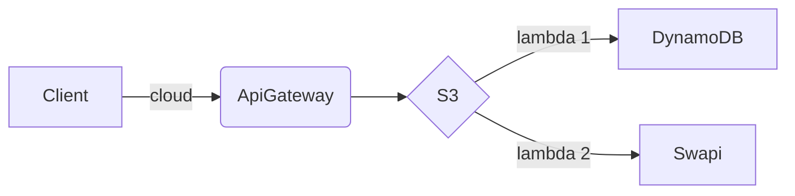

<!--
title: 'AWS Simple HTTP Endpoint example in NodeJS'
description: 'This template demonstrates how to make a simple HTTP API with Node.js running on AWS Lambda and API Gateway using the Serverless Framework.'
layout: Doc
framework: v3
platform: AWS
language: nodeJS
authorLink: 'https://github.com/serverless'
authorName: 'Serverless, inc.'
authorAvatar: 'https://avatars1.githubusercontent.com/u/13742415?s=200&v=4'
-->
# Arquitectura




## Usage

### Deployment

```
$ serverless deploy
```

After deploying, you should see output similar to:

```bash
Deploying aws-node-http-api-project to stage dev (us-east-1)

✔ Service deployed to stack aws-node-http-api-project-dev (152s)

endpoint: 
  GET - https://y7nchjy5bb.execute-api.us-east-1.amazonaws.com/
  POST - https://y7nchjy5bb.execute-api.us-east-1.amazonaws.com/tasks
  GET - https://y7nchjy5bb.execute-api.us-east-1.amazonaws.com/tasks
  GET - https://y7nchjy5bb.execute-api.us-east-1.amazonaws.com/tasks/{id}
  GET - https://y7nchjy5bb.execute-api.us-east-1.amazonaws.com/swapi
functions:
  api: api-lambda-dynamo-dev-api (18 MB)
  createTask: api-lambda-dynamo-dev-createTask (18 MB)
  getTasks: api-lambda-dynamo-dev-getTasks (18 MB)
  getTask: api-lambda-dynamo-dev-getTask (18 MB)
  getSwapi: api-lambda-dynamo-dev-getSwapi (18 MB)
```


# Autor : Alan Huanca Villaverde

To learn more about the capabilities of `serverless-offline`, please refer to its [GitHub repository](https://github.com/dherault/serverless-offline).
